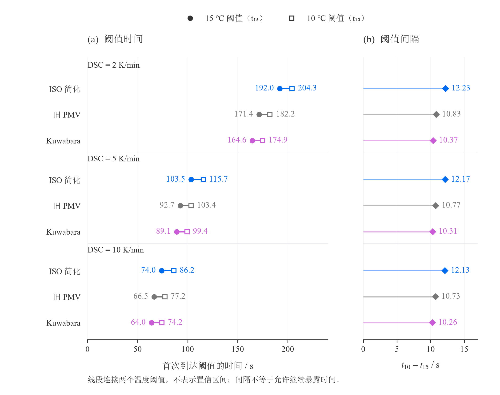
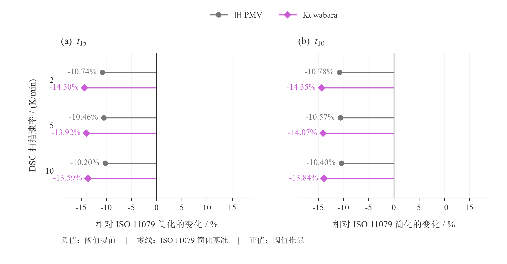
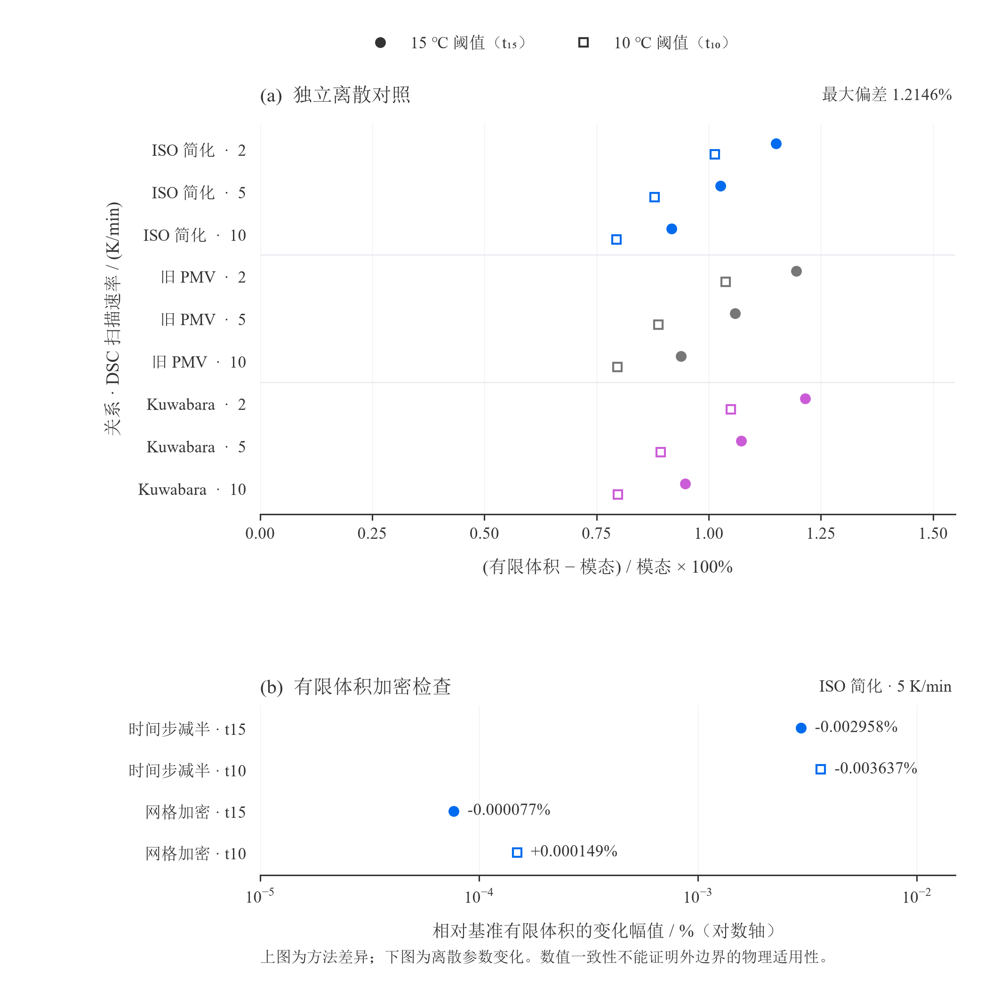

# 第二问绘图报告

## 1. 交付结论与使用范围

本轮交付三张 Python 图：**阈值时间、边界敏感性、数值验证**。推荐正文优先使用“阈值时间”和“数值验证”；“边界敏感性”放在相关式选择讨论中，篇幅紧张时可移至补充材料，避免三图与结果表逐项重复。

三图分别回答：何时触及温度阈值？换一条外对流关系会改变多少？独立数值方法与加密检查支持到什么程度？没有为增加图数而拟合曲线、构造分布或补造温度历程。

### 数据与版本

- 求解模型版本：`91d96f4+Q1-3a1982f`；本轮绘图开始前仓库已同步至 `44a9649`。
- 模态数据：[外对流核算.csv](外对流核算.csv)，登记 `Q2-HCONV-SENS-20260827`，`FROZEN + CHECKED`。
- 独立验证：[外对流有限体积验证.csv](外对流有限体积验证.csv)，登记 `Q2-HCONV-FVM-20260827`，`FROZEN + CHECKED`。
- 三个外对流系数分别为 `18.46`、`20.9578147716`、`21.95 W/(m²·K)`，图中简称为“ISO 简化”“旧 PMV”“Kuwabara”；每种关系包含 DSC 扫描速率 `2/5/10 K/min` 三个确定性计算工况，不是重复实验样本。
- 阈值变量是贴身侧服装温度 `T_in=T_1(0,t)`；`t15`、`t10` 分别是该温度首次不高于 `15 ℃`、`10 ℃` 的时间，不是人体核心温度的阈值时间。

最新审核已通过采用 `18.46` 的主模型方向，但指出正文、伪代码与最终结果登记尚未同步，整问仍未冻结。**本轮冻结的是图与已核算数据的一致性，不是重新批准经验式或宣布终稿完成。** 图中的“ISO 简化”沿用输入表名称，不表示已从所提供的 PDF 预览核验完整附录，也不能把数值一致性写成标准适用性或实地实验验证。

## 2. 构图取舍

| 图 | 候选构图与取舍 | 最终选择 |
|---|---|---|
| 阈值时间 | 分组柱图方便读绝对量，但 18 根柱较拥挤；配对点图突出两个阈值及其间隔，但需要讲清线段含义 | 配对点图 + 对齐的间隔棒棒糖图 |
| 边界敏感性 | 热图紧凑但难精确比较正负幅度；零线发散点图保留全部工况和变化方向 | 按两个阈值分面的零线发散点图 |
| 数值验证 | 模态/FVM 一致性散点图会被约 1% 的差异压在对角线附近；直接绘相对差异能看见偏差，加密量级另图呈现 | 上部九工况差异点图 + 下部加密变化对数图 |

每组仅有三个 DSC 工况，全部展示，不画箱线图、置信带、分布图或光滑趋势线。旧 PMV 温度历程未覆盖新的主模型与全部对照工况，因此本轮不把它包装为最终主模型的降温曲线；仅凭两个阈值也不能重建连续温度历程。

## 3. 图一：阈值时间

**绘图工具：Python。** 用户明确指定 Python，故覆盖绘图 Skill 的 Origin 默认；不是声称此类图不能用 Origin。

- 研究问题：外边界关系和 DSC 工况分别怎样改变两个阈值的到达时间？阈值之间间隔多长？
- 图 (a)：横轴为秒，纵向按 DSC 工况分组，同组列出三个外对流关系；实心圆表示 `t15`，空心方形表示 `t10`。连接线只连接同一工况的两个阈值，**不是误差棒、置信区间或温度曲线**。
- 图 (b)：与左图逐行对齐，菱形位置为 `t10−t15`，从零开始的线段便于比较间隔。单独坐标轴避免约 10 秒的间隔被约 200 秒的绝对时间掩盖。
- 数据量：9 个工况、18 个阈值、9 个派生间隔。左图显示到 `0.1 s`，右图显示到 `0.01 s`，CSV 保留原始数值精度；显示位数不表示相同精度的物理预测能力。
- 读图发现：在本次离散工况中，ISO 简化的阈值最晚，Kuwabara 最早；ISO 简化、5 K/min 对应 `t15=103.492 s`、`t10=115.666 s`。三个 DSC 工况的差异比同一 DSC 下三条关系的差异更大，但不据此外推任意扫描速率。
- 结论限制：间隔不能解释为“进入风险后还可安全停留的时间”；DSC 扫描速率是材料数据工况，不是现场空气风速，也不是可直接操控的防护策略。

数据：[阈值时间.csv](../data/processed/阈值时间.csv)。字段：外对流模型、换热系数、扫描速率、两个阈值时间、阈值间隔。无需另查原始表或计算间隔即可画图。

输出：[矢量 SVG](../figures/阈值时间.svg) / [PNG 预览](../figures/预览/阈值时间.png)。尺寸 `180 × 142 mm`。

建议图注：**不同外对流关系与 DSC 工况下贴身侧服装温度的阈值时间。** (a) 首次达到 15 ℃ 与 10 ℃ 的时间；(b) 两阈值的时间间隔。连接线表示阈值配对，不表示统计不确定性。间隔不作为允许继续暴露时间。



## 4. 图二：边界敏感性

**绘图工具：Python。** 按用户明确指定实现，与图一共用类别配色和数据来源。

- 研究问题：相对 ISO 11079 简化主模型，其他外对流关系让阈值提前还是推迟，幅度是否值得在正文解释？
- 分别以 `t15`、`t10` 为两个子图，横轴为相对变化百分数，ISO 11079 简化关系定义为零线，不再画一组全零柱。
- 计算式：`变化 = 100 × (本关系阈值 / 同一扫描速率的 ISO 阈值 − 1)`。负号表示提前，正号表示推迟；这是相关式对照，不是误差率或概率。
- 数据量：6 个非基准工况、每个两个阈值，共 12 个点。相同 DSC 行内的两类点作固定的类别排布偏移以免遮挡，不改变横轴数据，也不表示扫描速率偏移。
- 横轴对称为 `−19%～19%`，使正负比较不受轴长误导；圆点与菱形提供颜色之外的类别识别。标注显示到 `0.01%`。
- 读图发现：旧 PMV 相对 ISO 简化提前约 `10.20%～10.78%`，Kuwabara 提前约 `13.59%～14.35%`。因此外对流关系选择有实质影响，不能把不同来源的关系无说明地互换。
- 结论限制：三条关系不是三个同等地位的最终主模型，也不是随机抽样。图不能证明哪个经验式物理上最准确，不能把相对变化当作完整模型的不确定区间。

数据：[边界敏感性.csv](../data/processed/边界敏感性.csv)。字段：外对流模型、扫描速率、两个阈值相对 ISO 主模型的有符号变化。只含需要绘制的两种非基准关系。

输出：[矢量 SVG](../figures/边界敏感性.svg) / [PNG 预览](../figures/预览/边界敏感性.png)。尺寸 `180 × 94 mm`。

建议图注：**外对流关系对阈值时间的影响。** 以同一 DSC 工况下的 ISO 11079 简化阈值为分母，比较旧 PMV 与 Kuwabara 关系的相对变化。正值表示阈值推迟，负值表示提前；零线为 ISO 主模型。



## 5. 图三：数值验证

**绘图工具：Python。** 按用户明确指定实现，上下两图分开处理不同的分母和数值量级。

- 研究问题：全部九个工况是否都经过有限体积复核？方法间差异和有限体积加密变化各有多大？
- 图 (a)：9 个工况各画两个阈值，共 18 个点。横轴为 `100 × (有限体积阈值 / 模态阈值 − 1)`，保留符号；当前这些点均为正，表示 FVM 阈值略晚。图中不添加没有依据的“合格误差线”。
- FVM 基准设置：时间步 `0.025 s`、每层 `24` 个网格。模态设置见源运行报告，本轮不重新求解或调参。
- 图 (b)：仅 ISO 简化、5 K/min 工况，两次加密各对应两个阈值，共 4 个点。时间步减半为 `0.0125 s`、网格仍为每层 `24`；网格加密为每层 `36`、时间步仍为 `0.025 s`。
- 下图计算式为 `100 × (加密 FVM 阈值 / 基准 FVM 阈值 − 1)`，**分母不是模态结果**。横坐标画绝对幅值并采用对数轴，标注保留正负号和六位小数，避免把接近零的网格变化压没，也避免误认为对数轴可以放负值。
- 读图发现：九工况中，模态与 FVM 阈值最大相对偏差为 `1.2146%`。ISO、5 K/min 的时间步减半变化分别约 `−0.002958%`、`−0.003637%`；网格加密分别约 `−0.000077%`、`+0.000149%`。
- 结论限制：上述是已测工况下的差异，不是严格的全局误差界；一个工况的加密检查不等于所有工况的完整收敛证明。FVM 与模态存在约 1% 的方法间差异，不能仅因 FVM 加密变化小就宣称该差异已经消失。数值验证不替代外对流公式的物理适用性核验。

数据：[数值验证.csv](../data/processed/数值验证.csv)。22 行长表，字段为设置、外对流模型、扫描速率、阈值、有符号相对差异、绘图幅值。脚本按“设置”直接分面，不需要人工筛选、合并源表或计算百分数。

输出：[矢量 SVG](../figures/数值验证.svg) / [PNG 预览](../figures/预览/数值验证.png)。尺寸 `180 × 178 mm`。

建议图注：**独立有限体积复核与离散参数加密检查。** (a) 九个工况的阈值相对差异，以模态结果为分母；(b) ISO 简化、5 K/min 工况的时间步减半及网格加密变化，以基准 FVM 为分母。下图横坐标为变化绝对幅值的对数刻度，标签保留变化符号。两图均为数值检查，不是实验验证。



## 6. 视觉规范与编辑方式

- 统一白底、轻网格、弱边框，以留白、对齐和少量重点颜色建立层级；不使用三维、渐变背景、阴影和大面积高饱和填充。
- ISO 简化为蓝色 `#006BEE`，旧 PMV 为灰色 `#777777`，Kuwabara 为紫色 `#CB5CD7`。跨图不改变颜色含义，配合文字行标签、阈值形状和空实心区分，不能只靠颜色读图。
- 中文宋体、英文及数字 Times New Roman，主体 `8.5 pt`，轴标题 `9 pt`，分图标题 `10 pt`，说明 `8 pt`。全图宽 `180 mm`；刊载时不要直接缩成 90 mm 单栏图，否则文字会减半，应重新调整布局后导出。
- 线宽主要为 `1.1～1.4 pt`，主标记约 `4.5 pt`。图内不放重复的总标题，由论文图注承接解释。
- 三张 SVG 均为无嵌入位图的矢量文件，文字保留为文本对象，后期可在支持 SVG 的编辑器调整；接收机器需安装相应字体。它们**不是 OPJU，也不具有 Origin 原生数据绑定**。PNG 为 300 dpi 预览；需要导入其他版式时优先使用矢量原件。
- 当前环境未提供 `set_plot_spec/get_plot_spec`，所以未调用或宣称已登记其会话规范；所有实际规格明确固定在 Python 源码和本报告中。

## 7. 复现与参数调整

三个文件分别负责数据整理、最终绘图和检查，不向正式求解代码加入审计或图形依赖：

- [绘图数据.py](../code/绘图数据.py)：从两张已核算 CSV 整理逐图数据，复核派生值和版本对应关系。
- [第二问绘图.py](../code/第二问绘图.py)：只读三张独立绘图表，生成全部图像；不依赖个人附件目录。
- [绘图检查.py](../code/绘图检查.py)：重建画布检查文字边界，核对已导出的 SVG、PNG，不重写图片。

在仓库根目录执行：

```powershell
python modules/30_q2/code/绘图数据.py modules/30_q2/results modules/30_q2/data/processed
python modules/30_q2/code/第二问绘图.py modules/30_q2/data/processed modules/30_q2/figures
python modules/30_q2/code/绘图检查.py modules/30_q2/data/processed modules/30_q2/figures
```

以上命令会重生成同名派生数据和图像。试调样式时应将输出参数改为新的临时目录，保留已交付版本。修改数据或代码后，旧运行报告不再代表修改后的图，需要重新运行外部审计并验收。

本轮环境：Python `3.12.7`、Matplotlib `3.11.0`、NumPy `2.4.4`，另需 Pillow 运行图像检查。字体依赖为 Times New Roman、SimSun；非 Windows 环境需先安装或显式替换字体并重新目视检查。

主要可调参数在 `第二问绘图.py` 中：顶部 `COLORS`、`DPI`、`rcParams`；各 `draw_*` 的 `figsize`、`subplots_adjust`、坐标范围和文字偏移。当前排布针对三种关系、三个 DSC 工况；增加工况后要同步修改排布并重新检查，不能依赖旧画布自动容纳。

## 8. 实际验收与剩余事项

- 数据整理与最终绘图均经 Skill 外部 `run_gate.py` 在新鲜目录真实运行，分别见 [绘图数据运行.json](绘图数据运行.json)、[绘图运行报告.json](绘图运行报告.json)，状态均为 `PASS`；审计逻辑未混入绘图脚本。
- 数据层核对了九工况完整性、阈值有限且有序、敏感性重算、模态/FVM 源值对应及加密分母，没有平滑、拟合或随机抽样。
- 最终版运行无字体缺字警告。三张 PNG 已逐张目视检查，标签、点线、图例与分图之间未发现遮挡或裁切；字体、层级和留白一致。
- 自动检查覆盖 134 处文字边界；三张 SVG 无嵌入位图且物理宽度为 180 mm；PNG 尺寸分别为 `2125×1677`、`2125×1110`、`2125×2102` 像素。这些检查与目视验收互补，不能代替数学模型审核。
- 将图和数据复制到仓库固定目录后重新执行检查；两份运行记录中的源码、输入和输出共 16 项哈希均与交付文件相符。报告 19 个资源链接均可解析，三个脚本语法检查、`git diff --check`、冲突标记检查及仓库 `final_preflight.py` 通过；预检仍提示其他章节的既有排版建议，本轮未越界修改。
- 本轮未把图插入正文，也未修改求解模型。后续论文整合需要按 `44a9649` 审核完成主模型、接口坐标、ISO 简化推导、符号和算法同步，再引用选定图并解释结论；不应因本绘图包已验收就把整问标记为终稿冻结。

## 9. Origin 一图一表交付

根据最新绘图审核及“一图一表”的文件交付要求，已生成三个独立 XLSX 文件，每个文件仅有一张工作表和一个扁平数据表，不再将三图数据合在同一个工作簿内。这些文件仅用于 Origin 导入和后续排版，不替代仓库内三份 CSV 真源。

每张完整图对应一个独立文件（同一组合图的上下分图仍保留在该图的同一张表中）：

| 独立文件 | 直接绘图列 | 图的论证作用 |
|---|---|---|
| [阈值时间.xlsx](../data/processed/阈值时间.xlsx) | `类别`、`t15（s）`、`t10（s）`、`阈值间隔（s）`；`β_DSC`、模型与 `h_e` 用于分组和标注 | 比较 ISO 主模型与两个关系对照的绝对阈值时间，并展示两个阈值的间隔 |
| [边界敏感性.xlsx](../data/processed/边界敏感性.xlsx) | `类别`、`t15相对ISO（%）`、`t10相对ISO（%）`；同时保留原始时间和 ISO 分母列 | 以 ISO 11079 简化关系为零基准，显示其他关系会使阈值提前或推迟多少 |
| [数值验证.xlsx](../data/processed/数值验证.xlsx) | 上图使用 `模态-FVM差异（%）`；下图使用 `加密幅值（%）`，符号在 `加密变化（%）` | 分离九工况方法差异与 ISO 5 K/min 的 FVM 加密变化，避免混用分母 |

数值列均为真实数值而非带单位字符串；敏感性表中的百分数由工作表公式计算，阈值间隔、方法差异和加密幅值也保留为可审计公式。Origin 可直接导入指定列，不需重新透视、合并或计算。`数值验证` 中基准行的加密列留空，正是为了让 Origin 分图时不误把两类量画在同一系列。

三个文件均保留深色表头、浅色交替行、ISO 主模型浅蓝高亮、冻结首行和关闭网格线；不使用颜色作为唯一数据编码。拆分后逐个重新导入，数据与原表逐单元格一致（空字符串与空单元格按等价空白核对），分别保留 9、18、66 个公式，无公式错误，渲染预览已复核。文件均落在 Q2 固定的 `data/processed/` 目录。原合并文件已由这三个独立文件替换，历史版本可从 Git 恢复；本次只修正交付组织，不更改模型、原始结果或图像。
