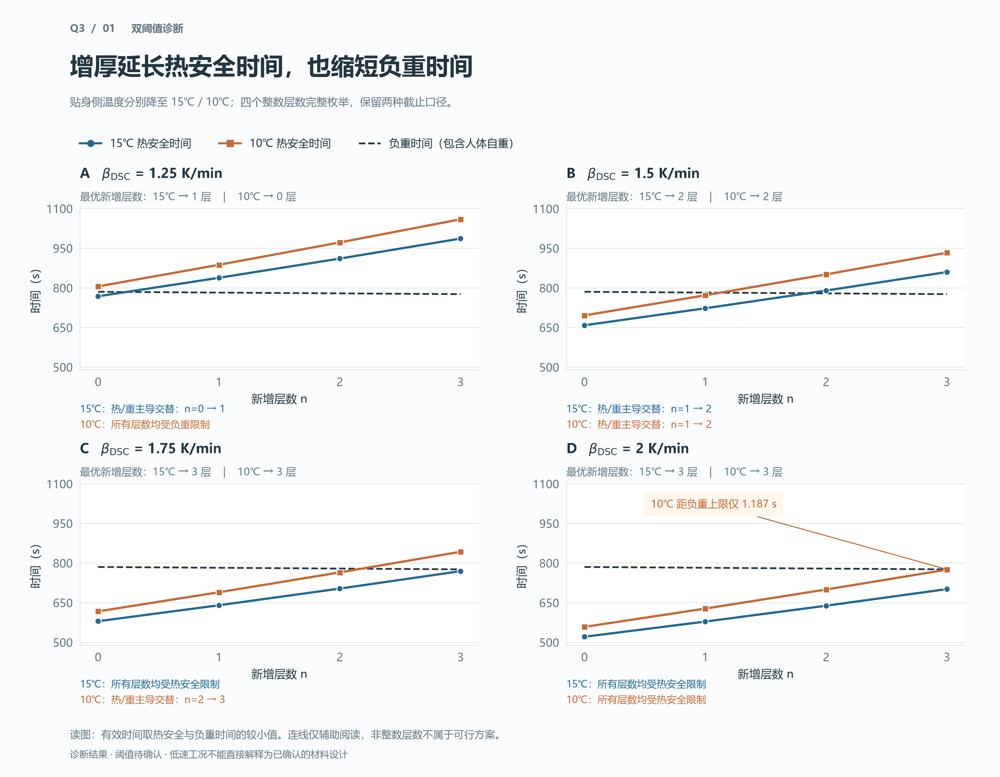
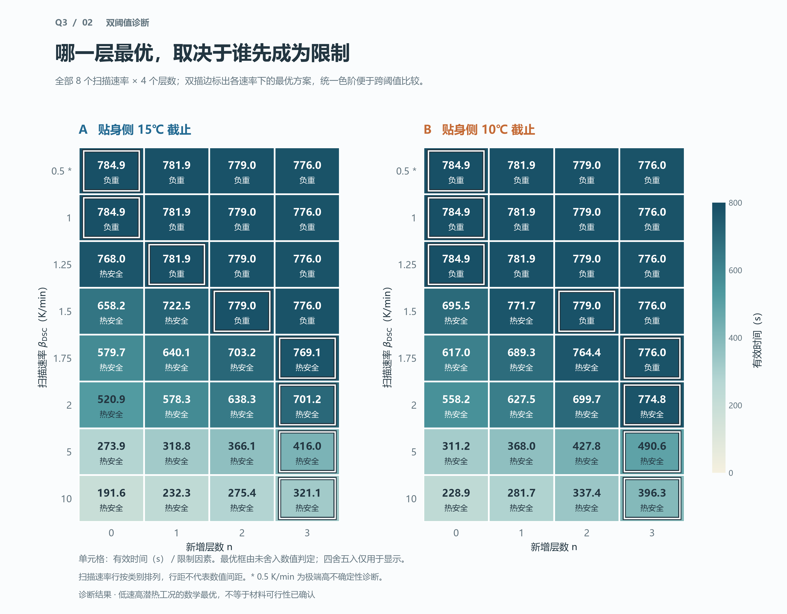
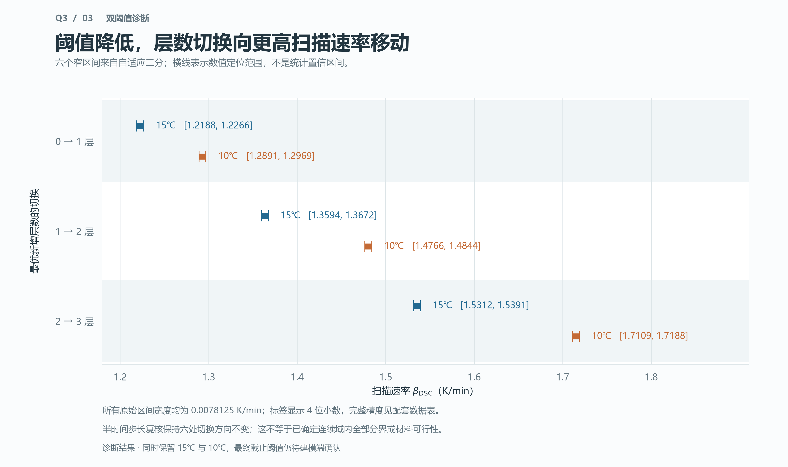

# 问题三 Python 绘图报告

日期：2026-08-27。交付：3 张 300 dpi PNG、3 份中文绘图数据表、1 个独立 Python 绘图脚本。

## 1. 结论与使用范围

本次三张图分别回答“为什么出现权衡”“每个工况哪一层最优”“两种阈值的切换位置差多少”。已经实际生成并逐张查看，完成一轮版式调整。推荐优先用**有效时间全景**进行团队讨论，用**热安全与负重权衡**解释机制，用**双阈值切换区间**呈现阈值差异。

当前为诊断精绘，不是最终论文结果冻结。所有图片明确保留 `15℃/10℃` 双口径，数据仍为 `VALIDATED + NEEDS_REVIEW`；未改动求解器、原始诊断结果、原有图片、结果登记或正文。

## 2. 来源与数值定义

- 数据基线：Git 提交 `90c1187`，其中数值诊断由 `764375a` 提交，随后新增审核意见而未改数值。
- 结果编号：`Q3-1.1-20260827`；模型：`WHUT13-Q3-LOW-RATE-AUDIT`，版本 `1.1`。
- 来源目录：[低速扫描重审](EXPERIMENT/低速扫描重审/)。读取 `粗扫描方案.csv`、`粗扫描最优方案.csv`、`切换区间.csv`，半步长说明依据已有 `临界步长检查.csv`。
- 热安全时间：贴身侧温度 `T_in(t)=T_1(0,t)` 首次降到相应阈值的时间，不是恒定为 `37℃` 的人体边界温度下降。
- 有效时间：`t_eff,θ = min(t_θ,t_W)`；负重时间包含 `60 kg` 人体自重。
- 面积为 `A=A_b=1.6521 m²`。本组不是 `A=1.25A_b` 面积对照，不能混用两套结果。
- 决策变量仅为 `n=0,1,2,3`，分别增加 `0,0.3,0.6,0.9 mm` 外层厚度。
- 原正演参数为 `dt=0.25 s、M=40、nq=160`；已有切换端点采用 `dt=0.125 s` 复核。本次仅绘图，没有重新执行正演或新增推断方法。

## 3. 图形设计与实际效果

### 图 1：热安全与负重权衡



配套数据：[热安全与负重权衡.csv](../data/processed/诊断绘图/热安全与负重权衡.csv)，16 行 × 5 列。尺寸为 `4050×3150 px`。

**论证作用：** 在相同坐标尺度下，比较外层增厚的热安全收益和负重损失，解释有效时间为何不总随层数增加。

设计：采用 `1.25/1.5/1.75/2 K/min` 四个小面板，覆盖已检测到的权衡变化；蓝色圆点为 15℃，橙色方点为 10℃，深灰虚线为负重时间。面板列出两种口径的最优层数及热/重主导交替所在的相邻整数候选。

观察：

- `1.25 K/min` 时，15℃最优为新增 1 层，10℃最优为不新增层。较长的热安全时间并不必然要求更多层，因为各层方案可能都先触及负重限制。
- `1.5 K/min` 时，两种阈值均选新增 2 层；`1.75 K/min` 时均选新增 3 层，但 15℃受热安全限制、10℃受负重限制。
- `2 K/min,n=3` 时，10℃热安全时间为 `774.807643 s`，负重时间为 `775.994326 s`，差 `1.186683 s`。图中特别标注 `1.187 s`，防止把视觉接近误认为精确相交。

效果评价：机制清楚，蓝橙加点型避免只靠颜色辨别；统一纵轴防止不同面板的斜率被夸大。负重线下降只有约 `8.921 s`，在完整热安全时间尺度上近乎水平是数据特性；因此用图 2 的直接数值补足辨识，而不另设夸大的双纵轴。纵轴为局部时间范围，未从零起，图中已明确刻度，不用于柱高比例比较。

建议图注：不同扫描速率下新增外层数对双阈值热安全时间和负重时间的影响。离散候选为 `n∈{0,1,2,3}`，有效时间取两类时间的较小值；连线仅辅助阅读，不代表允许非整数层数。

### 图 2：有效时间全景



配套数据：[有效时间全景.csv](../data/processed/诊断绘图/有效时间全景.csv)，32 行 × 6 列。尺寸为 `3840×3000 px`。

**论证作用：** 一次展示全部 8 个速率、4 个层数、2 种阈值的有效时间和限制因素，并突出最优方案。

设计：两面板共用 `0–800 s` 顺序色阶，深色表示时间更长；格内直接显示秒数及限制因素，双描边框标出各行最优层数。扫描速率按类别等距排列，已注明行距不代表实际速率间距。

观察：在 `0.5/1 K/min` 两个已算点，两种口径均由负重控制且不新增层最优；`1.25 K/min` 的两种阈值给出不同层数。`2/5/10 K/min` 三个已算点，两种阈值均选新增 3 层且均受热安全限制。`0.5 K/min` 带星号标记为极端高不确定性诊断。

效果评价：这是三图中最适合快速核对的总览。相邻厚度的负重时间差只有约 `2.974 s`，仅靠热图颜色难辨，因此同时保留一位小数、文字限制因素和最优框。最优框使用未舍入数据计算，不用显示值判定。64 个格子的文字均已查看，未发现缺字、遮挡或出界；浅色格用深色字、深色格用白字。

建议图注：两种截止阈值下的有效时间全景。每格为有效时间及先到达的限制，双描边表示该速率下完整离散枚举的最优候选；色阶跨面板一致。

### 图 3：双阈值切换区间



配套数据：[双阈值切换区间.csv](../data/processed/诊断绘图/双阈值切换区间.csv)，6 行 × 5 列。尺寸为 `3840×2280 px`。

**论证作用：** 展示最终阈值选择会影响最优层数切换的位置，不能直接沿用单一 15℃口径。

设计：三个水平组分别表示 `0→1、1→2、2→3`，每组的蓝橙横线给出两种阈值的真实数值定位区间。端点标记、阈值文字和分组底色共同辅助阅读；不加平滑曲线、连续相区填色或虚构的精确切换点。

观察：三组 10℃切换区间都位于对应 15℃区间右侧。六个原始区间宽度均为 `0.0078125 K/min`；图内区间保留四位小数，CSV 保留原精度。已有半步长检查保持六次切换方向不变。

效果评价：区间虽窄，横线端帽和直接标签仍能辨识；最后一组标签位于画布内，不与坐标或页脚重叠。该图表达的是已检测切换的定位范围，不是统计置信区间，也不证明连续域中所有切换已穷尽。

建议图注：双阈值下最优新增层数的切换区间。区间来自真实正演结果的自适应二分定位，不表示统计不确定性；阈值改变使检测到的切换范围移动。

## 4. 风格与视觉验收

本次采用浅底、深灰文字、统一标题层级、蓝橙双阈值和低干扰网格；不采用三维柱体、彩虹色阶、阴影或装饰性背景。清晰的数据层级和注释承担主要视觉表达。

实际执行：

1. 首次运行生成全部 PNG，并逐张打开查看。
2. 发现图 1 底部说明偏紧，增大底部留白并调整面板位置；把“无交叉”改为具体的全层限制因素。图 3 减少标题与绘图区的空白。
3. 再次运行全部绘图，重新查看修改后的图 1、图 3；图 2 代码与数据未改变，视觉保持原验收效果。
4. 检查中文、单位、图例、点型、直接数值、最优框、端点和页脚，当前未发现遮挡、乱码或裁切。

使用建议：目前属于适合屏幕审阅的完整诊断版，长说明刻意保留。若后续进入论文，需先确认阈值与结果状态，再把大标题/页脚移入论文图注并按最终版心复查字号。当前不建议将图 1 的整套四面板缩到半栏，也不宣称已经完成论文最终排版验收。

## 5. 数据校验与复现

绘图脚本：[第三问绘图.py](../code/第三问绘图.py)。只读取已有结果，不依赖本地未跟踪的 Excel 附件，也不导入求解器。

在仓库根目录运行：

```powershell
$env:PYTHONUTF8='1'
& 'D:/python3.12.7/python.exe' modules/40_q3/code/第三问绘图.py
```

本机运行环境为 Python `3.12.7`、Matplotlib `3.11.0`、NumPy `2.4.4`；中文字体为 Microsoft YaHei。其他系统复现时需提供该字体或明确替换为可用中文字体，再检查版式。

脚本已通过：32 个方案双阈值数值有限性、`t_eff=min(t_θ,t_W)`、四层候选完整性、16 个最优层数与已存最优表一致性、6 个切换区间宽度检查。CSV 使用 UTF-8 BOM，文件名与列名均为中文，单位保留在列名；每张图对应一份仅含绘图所需列的数据表。

重复执行只刷新本次同名精绘 PNG 和绘图数据表。未覆盖 `EXPERIMENT/低速扫描重审/` 内的旧数据或旧图，也未输出重复的 SVG/PDF/EPS。

## 6. 结论边界与后续交接

- 本组能够说明：当前模型在已计算的低速工况下确实会出现整数内部最优，且两种截止阈值的优化结构不同。
- 本组不能说明：低速反演出的高潜热材料已证实可用；两种阈值中任一个已经确认；或扫描区间内最优层数的全部连续结构已获严格证明。
- 原数量级审查中的 `260 kJ/kg` 只作选定商业产品的比较量，不是所有 PCM 的物理上限，本次没有把它绘成普适材料边界。当前图表也不足以证明某个连续“可信材料参数域”内从不出现内部最优。
- `n=3` 是本题离散预算候选集的上边界，不表示材料费用恰好等于预算上限。
- 下一步仍为建模端确认最终阈值与材料参数解释，随后再按仓库流程冻结结果、选择正文图；本次不代为确认或冻结。
